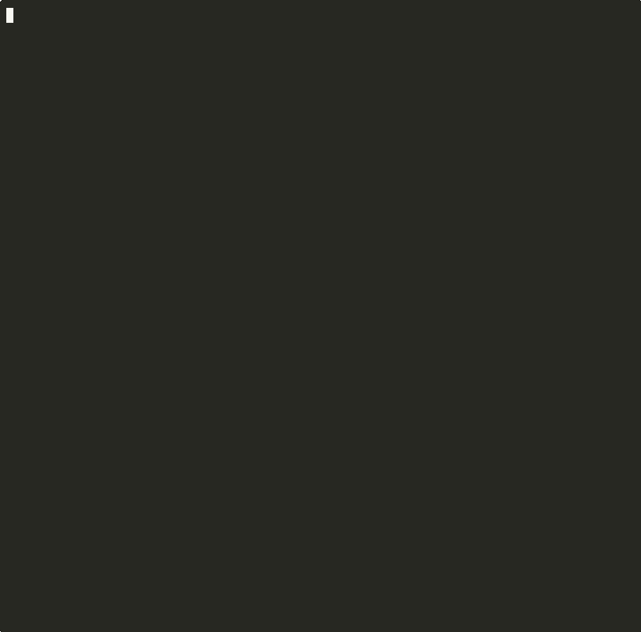

# BreakPoint FastAPI + LLM Demo

Watch BreakPoint catch a +68% cost regression before deploy. Self-contained, **no API keys required** — uses pre-baked artifacts.



## Quick Start

```bash
# From the breakpoint-ai repo root
cd examples/fastapi-llm-demo
make install
make good        # Should PASS
make bad-tokens  # Should BLOCK — see why!
```

## Prerequisites

- Python 3.10+
- pip
- BreakPoint (`make install` pulls it)

## Make Targets

| Target | Description |
|--------|-------------|
| `make install` | Install deps (requests, breakpoint-ai) |
| `make good` | Compare baseline vs good candidate → PASS |
| `make bad-tokens` | Compare vs cost-inflated candidate → BLOCK (Cost +68%) |
| `make bad-pii` | Compare vs PII-containing candidate → BLOCK (PII detected) |
| `make bad-format` | Compare vs plain-text candidate → BLOCK (drift) |
| `make show-cost-diff` | Show baseline vs bad_tokens cost/token summary (for demo GIF) |
| `make demo-all` | Run good + all bad scenarios |

## What BreakPoint Catches

1. **bad-tokens**: Same output, but verbose prompt caused +70% tokens → cost spike → BLOCK
2. **bad-pii**: Email and phone number in output → BLOCK
3. **bad-format**: JSON expected, plain text returned → drift BLOCK

## Optional: Run with Ollama

To generate live candidates from a local LLM:

```bash
# Ensure Ollama is running: ollama run llama3.1:8b
python -c "
from app.llm import call_llm
import json
r = call_llm('good')
print(json.dumps(r, indent=2))
"
```

Then compare the output with `breakpoint evaluate app/baselines/baseline.json <candidate.json>`.

## CI Integration

Copy the workflow template to your repo:

```bash
cp .github/workflows/breakpoint-gate.yml ../../.github/workflows/
```

Or adapt the env vars for your paths:
- `BREAKPOINT_BASELINE`: path to approved baseline
- `BREAKPOINT_CANDIDATE`: path to new candidate
- `BREAKPOINT_FAIL_ON`: `block` or `warn`

## Links

- [Main README](../../README.md)
- [User Guide](../../docs/user-guide.md)
- [Install-Worthy Examples](../../docs/install-worthy-examples.md)
